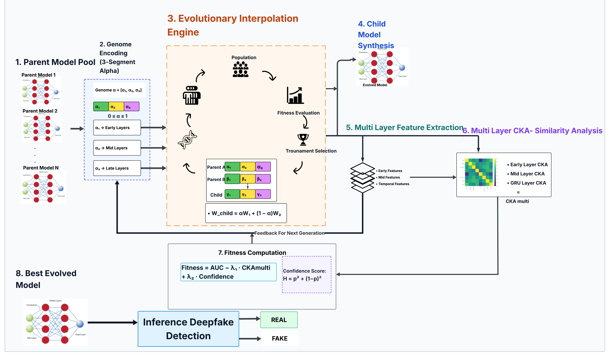

# MeGA-IA: Genetic Algorithm-Driven Weight Merging for In-the-Wild Audio Deepfake Detection

<div align="center">



<br/>

**Training-free genetic weight merging for domain adaptation in audio deepfake detection**

Achieves **0.6063 AUC** on the Deepfake-Eval-2024 benchmark using only weight-space evolution between two independently trained parent models — **without any gradient-based fine-tuning**.

<br/>

[](https://python.org)
[](https://pytorch.org)
[](https://creativecommons.org/licenses/by/4.0/)
[]()

</div>

---

# Overview

Modern audio deepfake detectors perform extremely well on laboratory datasets such as ASVspoof 2019, yet fail catastrophically on real-world social media audio.

The [Deepfake-Eval-2024 benchmark](https://arxiv.org/abs/2503.02857) formally showed that many detectors suffer performance drops exceeding **40%** when evaluated on in-the-wild (ITW) distributions.

MeGA-IA addresses this problem **without retraining**.

Instead of fine-tuning, we evolve interpolation coefficients between two independently trained RawNet2 parent models using a genetic algorithm guided by a small ITW validation proxy dataset.

The final merged model achieves:

| Model | Deepfake-Evals 2024 AUC |
|---|---|
| Parent 1 — RawNet2 LA Specialist | 0.530 |
| Parent 2 — RawNet2 ITW Specialist | 0.483 |
| **MeGA-IA (Best E01 Configuration)** | **0.6063** |

This corresponds to:

- **+7.8 percentage points** over the stronger parent
- **No gradient updates**
- **No additional training**
- **Pure weight-space evolution**

---

# Key Idea

Two parent models are trained on different domains:

| Parent | Domain | Strength |
|---|---|---|
| P1 | ASVspoof 2019 LA | Clean-domain spoof detection |
| P2 | Müller ITW Dataset | Robustness to real-world distortions |

The framework evolves interpolation coefficients:

```math
W_{child} = \alpha W_{P1} + (1-\alpha) W_{P2}
```

using:

- Tournament selection
- Blend crossover
- Gaussian mutation
- AUC-based fitness optimisation on an ITW proxy validation set

Unlike standard fine-tuning:

- no gradients are computed,
- no backpropagation occurs,
- no parent knowledge is overwritten.

---

# Architecture

## Framework Pipeline

```text
Parent 1 (RawNet2 — ASVspoof LA)
Parent 2 (RawNet2 — ITW Robustness)
                │
                ▼
        Genome Encoding
   {α₁, α₂, ..., αₙ} ∈ [0,1]
                │
                ▼
     Weight Interpolation
 Wchild = α·WP1 + (1−α)·WP2
                │
                ▼
   Fitness Evaluation on DFE-Val
       + Confidence Reward
       - CKA Regularisation
                │
                ▼
 Tournament Selection
 Blend Crossover
 Gaussian Mutation
                │
                ▼
      Best Evolved Child
                │
                ▼
Evaluation on Deepfake-Evals 2024
```

---

# Repository Structure

```text
mega_ia/
├── assets
│   └── architecture.png
├── models
│   ├── model.py
│   ├── parent1_la_best_model.pth
│   ├── parent2_itw_best_auc.pth
│   └── parent2_itw_latest.pth
├── notebooks
│   ├── experiments
│   │   ├── phase1_v1.ipynb
│   │   └── phase2_v2_v3.ipynb
│   └── training
│       ├── Train parent with LA set
│       │   ├── main.py
│       │   └── model.py
│       └── Train parent with muller dataset
│           └── Train_Parent2_ITW.ipynb
├── paper.pdf
├── README.md
└── src
    └── mega_ia
        └── mega_ia.py
```

---

# Open-Source Resources

## 1. DFE-Val Proxy Validation Dataset

A lightweight in-the-wild proxy dataset used as the GA fitness signal.

### Dataset Details

| Property | Value |
|---|---|
| Clips | 102 |
| Real | 51 |
| Fake | 51 |
| Sources | Instagram, TikTok, YouTube Shorts, Twitter/X |
| Purpose | Lightweight ITW validation proxy |
| License | CC-BY-4.0 |

### Hugging Face Dataset

- https://huggingface.co/datasets/ALLA1N/In-the-wild_validation-dataset

---

## 2. Parent Model Weights

### Parent 1 — Clean-Domain Specialist

RawNet2 trained on ASVspoof 2019 Logical Access.

- https://huggingface.co/ALLA1N/rawnet2-la-clean-specialist

### Parent 2 — ITW Robustness Specialist

RawNet2 trained on Müller et al. ITW dataset with aggressive robustness augmentation.

- https://huggingface.co/ALLA1N/rawnet2-itw-robustness-specialist

---

# Experimental Results

## Parent Baselines

| Model | Evaluation Set | AUC | EER |
|---|---|---|---|
| P1 (LA) | Deepfake-Evals 2024 | 0.530 | — |
| P2 (ITW) | Deepfake-Evals 2024 | 0.483 | 51.91 |
| P1 (LA) | ASVspoof LA | 0.936 | 11.40 |
| P2 (ITW) | ITW Validation | 0.703 | 34.26 |

---

## Best MeGA-IA Results

| Rank | Experiment | Genome Mode | Fitness | Test AUC |
|---|---|---|---|---|
| 1 | E01 v2 Full | segment3 | confidence | **0.6063** |
| 2 | E11 Layerwise6 | layerwise6 | confidence | 0.5883 |
| 3 | E13 DFE-Val Fit | segment3 | confidence | 0.5741 |

---

# Key Findings

- Heterogeneous parent training is critical for successful merging.
- Confidence-based fitness consistently outperformed entropy-based optimisation.
- Weight-space evolution alone can outperform both parents on ITW distributions.
- Segment3 genomes achieved the best convergence under low generation budgets.
- The framework works without any retraining or catastrophic forgetting.

---

# Setup

## 1. Clone Repository

```bash
git clone https://github.com/AWW4B/mega_ia.git
cd mega_ia
```

---

## 2. Install Dependencies

```bash
pip install torch torchaudio numpy scipy scikit-learn tqdm
```

---

# Dataset Setup

This repository does **not** redistribute the original benchmark datasets.

Please obtain them from their official sources.

## Required Datasets

### ASVspoof 2019 Logical Access

Official source:

- https://www.asvspoof.org/index2019.html

---

### Müller et al. In-the-Wild Dataset

Official paper:

- https://arxiv.org/abs/2203.16263

---

### Deepfake-Eval-2024 Benchmark

Official benchmark paper:

- https://arxiv.org/abs/2503.02857

---

# Running Experiments

## Reproduce Best Configuration (E01)

Open:

```text
notebooks/experiments/phase2_v2_v3.ipynb
```

Use configuration:

```python
alpha_mode = "segment3"
fitness = "confidence"
generations = 10
population_size = 15
```

Recommended hardware:

- Kaggle Dual T4
- RTX 4000 Ada or higher

---

# Training Parent Models

## Parent 1 — LA Specialist

Training files:

```text
notebooks/training/Train parent with LA set/
```

Uses:

- ASVspoof 2019 LA
- Standard RawNet2 pipeline

---

## Parent 2 — ITW Specialist

Training notebook:

```text
notebooks/training/Train parent with muller dataset/Train_Parent2_ITW.ipynb
```

Includes:

- heavy codec simulation
- Gaussian channel noise
- random crop/pad
- telephony filtering

to maximise ITW robustness.

---

# Citation

If you use this work, please cite:

```bibtex
@inproceedings{ahmad2026megaia,
  title     = {MeGA-IA: Genetic Algorithm-Driven Weight Merging for In-the-Wild Deepfake Detection},
  author    = {Ahmad, Awwab and Ahmed, Rayan and Munir, Uwaid},
  booktitle = {Proceedings of the 23rd International Bhurban Conference on Applied Sciences and Technology (IBCAST)},
  year      = {2026},
  note      = {Under Review}
}
```

---

# Acknowledgements

This project builds upon the following works:

## MeGA

```bibtex
@article{yun2024mega,
  title={MeGA: Merging Multiple Independently Trained Neural Networks Based on Genetic Algorithm},
  author={Yun, Donghyeon},
  journal={arXiv preprint arXiv:2406.04607},
  year={2024}
}
```

---

## RawNet2

```bibtex
@INPROCEEDINGS{9414234,
  author={Tak, Hemlata and Patino, Jose and Todisco, Massimiliano and Nautsch, Andreas and Evans, Nicholas and Larcher, Anthony},
  booktitle={ICASSP},
  title={End-to-End Anti-Spoofing with RawNet2},
  year={2021},
  pages={6369-6373}
}
```

---

## Müller et al. ITW Dataset

```bibtex
@article{muller2022does,
  title={Does Audio Deepfake Detection Generalize?},
  author={M{\"u}ller, Nicolas M. et al.},
  journal={arXiv preprint arXiv:2203.16263},
  year={2022}
}
```

---

## Deepfake-Eval-2024

```bibtex
@misc{chandra2025deepfakeeval2024,
  title={Deepfake-Eval-2024: A Multi-Modal In-the-Wild Benchmark of Deepfakes Circulated in 2024},
  author={Nuria Alina Chandra et al.},
  year={2025},
  eprint={2503.02857},
  archivePrefix={arXiv},
  primaryClass={cs.CV}
}
```

---

# Authors

| Name | Affiliation |
|---|---|
| Awwab Ahmad | FAST-NUCES Islamabad |
| Rayan Ahmed | FAST-NUCES Islamabad |
| Uwaid Munir | FAST-NUCES Islamabad |

---

# License

This repository is released under the CC-BY-4.0 License.